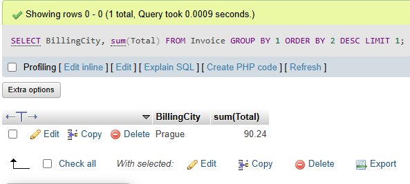

# **ACTIVIDAD 2**

**Tipo actividad: Taller de consultas SQL**

**Taller de consultas SQL**

Utilizando el editor de consultas (queries) que se puede ver en la figura 7 orientar a los estudiantes para que, escriban consultas SQL que permitan responder las siguientes preguntas:

# Ejercicio 1

Ejecutar y revisar el resultado de las siguientes consultas.

## Consulta 1

```sql
SELECT * FROM Invoice;
```


## Consulta 2

```sql
SELECT * FROM Employee;
```


## Consulta 3

```sql
SELECT 
	BillingCountry, 
    count(InvoiceId)
FROM 
	Invoice
GROUP BY 1
ORDER BY 2 DESC
```


# Ejercicio 2.

¿Qué país tiene más facturas?

```sql
SELECT 
	BillingCountry, 
    count(InvoiceId)
FROM 
	Invoice
GROUP BY 1
ORDER BY 2 DESC
LIMIT 1
```


# Ejercicio 3

Se quiere promocionar un nuevo festival musical, para ello es necesario saber en qué ciudad  hay mas facturas (invoices). Determinar en qué ciudad la suma de facturas es la mayor.  

```sql
SELECT 
	BillingCity,
    sum(InvoiceId)
FROM 
	Invoice
GROUP BY 1
ORDER BY 2 DESC
LIMIT 1
```



# Ejercicio 4

Determinar quien es el mejor cliente (el que mas ha gastado en el sistema)

```sql
SELECT 
	C.CustomerId, 
    C.FirstName, 
    C.LastName,
    SUM(I.Total) as TotalSpent
FROM 
	Invoice I
INNER JOIN 
	Customer C 
ON 
	I.CustomerId = C.CustomerId
GROUP BY CustomerId
ORDER BY TotalSpent DESC
LIMIT 1
```


# Ejercicio 5

Obtener una tabla con el correo, nombre y apellido de todos las personas que escuchan Rock. Retornar la lista por orden alfabético

```sql
SELECT 
	C.Email, 
    C.FirstName, 
    C.LastName,
    G.Name
FROM Customer C
INNER JOIN Invoice I ON C.CustomerId = I.CustomerId
INNER JOIN InvoiceLine IL ON IL.InvoiceId = I.InvoiceId
INNER JOIN Track T ON T.TrackId = IL.TrackId
INNER JOIN Genre G ON G.GenreId = T.GenreId
WHERE G.Name = 'Rock'
GROUP BY C.CustomerId
ORDER BY C.FirstName
```


# Ejercicio 6

Sacar una lista con todos los artistas que generan música rock  

```sql
SELECT 
	Ar.Name,
    G.Name
FROM Artist Ar
INNER JOIN Album Al ON Al.ArtistId = Ar.ArtistId
INNER JOIN Track T ON T.AlbumId = Al.AlbumId
INNER JOIN Genre G ON G.GenreId = T.GenreId
WHERE G.Name = 'rock'
GROUP BY Ar.Name
```


# Ejercicio 7

Encontrar cual es el artista que más ha ganado de acuerdo al campo invoiceLines.  

```sql
SELECT 
	Ar.Name,
    SUM(Il.Quantity * Il.UnitPrice) AS Total
FROM Artist Ar
INNER JOIN Album Al ON Al.ArtistId = Ar.ArtistId
INNER JOIN Track T ON T.AlbumId = Al.AlbumId
INNER JOIN InvoiceLine Il ON Il.TrackId = T.TrackId
GROUP BY Ar.Name
ORDER BY Total DESC
LIMIT 1
```


# Ejercicio 8

Encontrar cuanto gastaron en total en estados unidos en compras.

```sql
SELECT 
	Inv.BillingCountry,
    SUM(total)
FROM Invoice Inv
WHERE Inv.BillingCountry = 'USA'
GROUP BY Inv.BillingCountry
```


# Ejercicio 9

Encontrar cuánto gastaron los usuarios por género.  

```sql
SELECT 
	G.name,
    SUM(Inv.Total)
FROM Genre G
INNER JOIN Track T ON G.GenreId = T.GenreId
INNER JOIN InvoiceLine InL ON InL.TrackId = T.TrackId
INNER JOIN Invoice Inv ON Inv.InvoiceId = InL.InvoiceId
GROUP BY G.Name
```


# Ejercicio 10

Generar una tabla con el conteo de usuarios por cada país.  

```sql
SELECT 
	C.Country,
    count(*) AS CustomersCount
FROM Customer C
GROUP BY C.Country
ORDER BY CustomersCount DESC
```


# Ejercicio 11

Encontrar cuantas canciones hay por cada género.

```sql
SELECT
	G.Name,
    COUNT(T.TrackId) AS TrackCount
FROM Track T
INNER JOIN Genre G ON G.GenreId = T.GenreId
GROUP BY G.Name
ORDER BY TrackCount DESC
```

